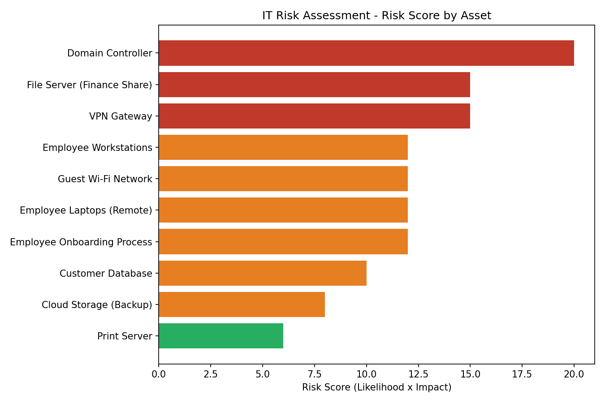

# IT Risk Assessment Lab

A self-contained IT risk assessment exercise: an asset/threat/vulnerability
register, a Python script that scores and prioritizes risk, a risk-to-control
mapping matrix, and a written risk assessment report. Modeled on the
qualitative Likelihood x Impact risk analysis approach described in
**NIST SP 800-30**, and mapped to the **NIST Cybersecurity Framework (CSF)**.

## What this project demonstrates
- Identifying assets, threats, and vulnerabilities across servers,
  endpoints, network, database, cloud, and process risk categories
- Scoring risk using a standard Likelihood x Impact model
- Assessing whether existing controls are effective at reducing risk
- Mapping findings to NIST CSF functions and recommending remediation
- Producing audit-style deliverables: a prioritized risk register, a
  risk and control matrix, and a written risk assessment report

## Project structure
```
IT-Risk-Assessment-Lab/
├── README.md
├── LICENSE
├── requirements.txt
│
├── data/
│   └── assets_risks.csv               # Raw asset/threat/vulnerability register
│
├── output/
│   ├── risk_summary_chart.png         # Generated on run
│   └── risk_register_prioritized.csv  # Generated on run
│
├── reports/
│   ├── Risk_Assessment_Report.md      # Written findings report
│   └── Risk_Control_Matrix.md         # Risk -> control gap -> recommendation -> NIST CSF mapping
│
└── src/
    └── risk_assessment.py             # Scores risk, outputs register + chart
```

## Sample output

Risk summary chart produced by `src/risk_assessment.py`:



## Risk scoring model
```
Risk Score = Likelihood (1-5) x Impact (1-5)

 1-6   -> Low
 7-14  -> Medium
15-25  -> High
```

## How to run
```bash
pip install -r requirements.txt
python src/risk_assessment.py
```

Run from the repository root. This reads `data/assets_risks.csv`,
calculates a risk score and rating for each entry, prints a prioritized
summary to the console, writes the full prioritized register to
`output/risk_register_prioritized.csv`, and saves a bar chart to
`output/risk_summary_chart.png`.

## Customizing
Add or edit rows in `data/assets_risks.csv` to assess a different
environment. Each row needs an asset, threat, vulnerability, a likelihood
(1-5), an impact (1-5), and the existing control, if any.

## Background
Built as a hands-on complement to CompTIA IT Audit/GRC coursework (Skillweed,
May-July 2023) covering risk assessment, control testing, and remediation
reporting.

## License
MIT, see [LICENSE](LICENSE).
